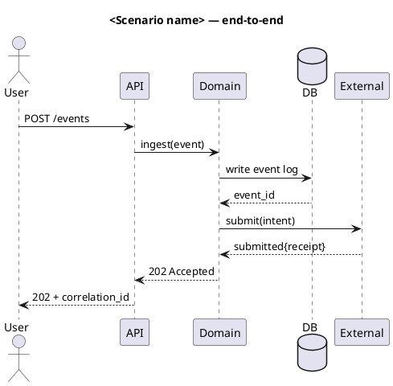
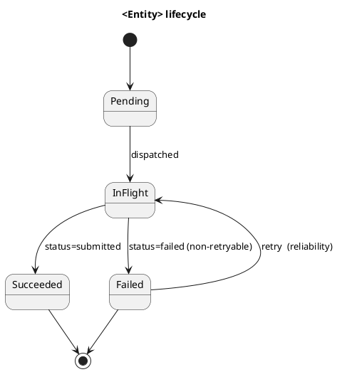
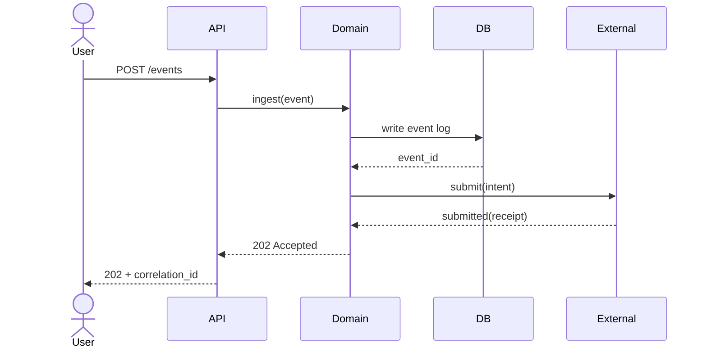

# Architecture Diagrams

## Overview

Architecture diagrams pin down a shared mental model that prose alone cannot. A spec or design doc that describes a multi-component system in text forces every reader to reconstruct the topology in their head, and every reader reconstructs it slightly differently. One diagram, drawn well, ends that ambiguity.

This skill encodes well-established practice — diagrams as code, named viewpoints, one viewpoint per file, drawn alongside design artifacts and reviewed together. The dominant modern vocabulary is the **C4 model** (Simon Brown): four nested levels — System Context, Container, Component, Code — with Sequence, State, and Deployment as universal partner viewpoints inherited from UML. C4 is not the only valid framework; the **4+1 architectural views** (Kruchten, 1995) and **arc42 building blocks** are the well-known alternatives. C4 is the recommended default because it is the most widely adopted in industry and has the cleanest tool support.

Diagrams belong in the same review surface as the design doc or spec they accompany, not in a separate pass after implementation. A diagram authored at design time is part of the design; a diagram added six months after launch is documentation about the design, which is a much weaker artifact.

## When to Use

- Authoring a `system-design-docs` artifact (Building Block View and Runtime View both expect diagrams)
- Authoring a `feature-design-doc` for a sub-feature with non-trivial structure or sequencing
- Authoring a spec for a system with ≥2 services or ≥3 named components
- Adding a new component, service, queue, store, or external dependency
- Changing transport (in-process → HTTP, sync → async, single DB → split, …)
- Introducing a new lifecycle (anything with ≥3 states and transitions worth naming)
- Reviewing a design or spec that describes structure in prose alone

**When NOT to use:** Single-component scripts, throwaway prototypes that won't survive the week, bug fixes, refactors that don't change topology, pure UI work with no backend shape.

## The Viewpoint Menu

A *viewpoint* answers one question. Choose the smallest set that answers the questions readers will have. Most non-trivial systems need two viewpoints; complex systems need four; more than five is almost always a sign the doc should be split.

| Viewpoint | Vocabulary | Answers | When to include |
|---|---|---|---|
| **System Context** (C4 L1) | C4 | "What sits at the boundary — who/what does this system talk to?" | When external dependencies are non-trivial. Often skipped for internal-only systems. |
| **Container** (C4 L2) | C4 | "What deployable units exist and how are they wired?" | When the system has ≥2 deployable units. The most-asked-for diagram. |
| **Component** (C4 L3) | C4 | "Inside one container, what are the parts and their responsibilities?" | When a single container has ≥4 components worth naming. |
| **Code** (C4 L4) | UML class / package | "What does the implementation look like at the class level?" | Rarely. Code is the source of truth; this viewpoint is usually wasted effort. |
| **Sequence** | UML | "How does *this specific scenario* flow through the parts?" | Always, for the flagship/golden-path scenario. Add more for retry, error path, multi-tenant. |
| **State machine** | UML | "What states can *this entity* be in, and what causes transitions?" | When an entity has ≥3 named states with non-trivial transitions. |
| **Deployment** | C4 / UML | "Where does this run, and what crosses a process or network boundary?" | When the runtime topology is not obvious from the Container view alone. |

A typical small system needs **Container + one Sequence**. A typical mid-size system needs **Container + Component (for the most complex container) + 1–2 Sequences + 1 State machine**. Beyond that you are usually splitting documents anyway.

## Authoring Rules

These rules are what keep diagrams reviewable, diffable, and truthful as the system evolves.

1. **Diagrams as code.** Use a text-based diagramming language. Never commit a binary export, screenshot, or link to a SaaS canvas as the primary source.
2. **One viewpoint per file.** No `.puml` or `.mmd` file with multiple `@startuml` blocks. Name the file kebab-case; the file name should match the diagram's identifier inside the source.
3. **Standalone files in `docs/diagrams/`.** Specs, design docs, and feature designs link to the diagram file by relative path. Do not inline diagram source in long prose docs — it makes review diffs unreadable and breaks the moment you want to reference the same diagram from a second doc.
4. **Maintain `docs/diagrams/README.md` as an index.** One row per diagram: file, viewpoint, purpose, which doc references it.
5. **Every relationship has a verb and a transport.** A line labeled "uses" or unlabeled is meaningless. Prefer "writes events to" / "reads JSON over HTTPS" / "publishes to Kafka topic".
6. **Phase-tag forward-looking elements.** If a component or transition only exists in a future phase, tag it inline — `(reliability)`, `(policy)` — and note it in the index. Do not leave the reader guessing what is shipped vs. designed.
7. **Diagrams are commit-tracked and PR-reviewed.** A diagram that lives in a wiki, an Excalidraw cloud, or a shared drive drifts from code within weeks; the only countermeasure is reviewing it the same way you review code.

## Tooling

There are four diagram-as-code tools worth knowing. Pick by repo conventions, not by personal preference.

| Tool | Strength | Weakness | Default for |
|---|---|---|---|
| **PlantUML** | Most ubiquitous; excellent C4-PlantUML; strong sequence and state; renders in JetBrains/VS Code/CLI | No native Markdown rendering on most hosts; requires plugin or pre-render | Repos where diagrams sit in `docs/diagrams/` and are linked from prose |
| **Mermaid** | Renders inline on GitHub/GitLab/Notion/Obsidian out of the box | Weaker C4 support (improving); layout less predictable for complex graphs | Single-file docs where the diagram is consumed inline |
| **Structurizr** | Native C4 model; one source produces all four C4 levels consistently | Steeper learning curve; the workspace concept; smaller community | Teams fully committed to C4 across many systems |
| **D2** | Modern syntax; best layout engine of the four; first-class theming | Newer ecosystem; smaller community; non-standard vocabulary | Greenfield repos with no prior tooling commitment |

**Recommended default: PlantUML with C4-PlantUML for structural diagrams; vanilla PlantUML for sequence/state/deployment.** This matches the most common industry practice, integrates with most IDEs out of the box, and produces text that diffs cleanly in PRs.

**Avoid as primary source:** Excalidraw, Lucid, Miro, Figma, draw.io desktop. Acceptable for whiteboarding; not acceptable as the source of truth, because they don't diff and tend to drift the moment they leave the editor.

## Templates

### C4 Container view (PlantUML + C4-PlantUML)

`docs/diagrams/container-diagram.puml`:

```plantuml
@startuml container-diagram
!include https://raw.githubusercontent.com/plantuml-stdlib/C4-PlantUML/master/C4_Container.puml

title <System Name> — containers
LAYOUT_WITH_LEGEND()

Person(user, "<User role>", "<one-line description>")
System_Ext(external, "<External system>", "<role>")

System_Boundary(sys, "<System Name>") {
  Container(api, "<API service>", "<runtime>", "<one-line responsibility>")
  Container(worker, "<Worker>", "<runtime>", "<one-line responsibility>")
  ContainerDb(db, "<DB>", "<engine>", "<what's stored>")
}

Rel(user, api, "manages triggers", "HTTPS / JSON")
Rel(api, db, "reads/writes via store interface", "SQL")
Rel(worker, external, "delivers messages", "HTTPS")
@enduml
```

### Sequence (PlantUML)

`docs/diagrams/sequence-<scenario>.puml`:



### State machine



### `docs/diagrams/README.md` (index)

```markdown
# Architecture Diagrams

Source-controlled architecture diagrams referenced from design docs, feature
design docs, and specs in this repo.

## Convention

- One viewpoint per file. No compound files with multiple `@startuml` blocks.
- File name is kebab-case and matches the diagram identifier inside.
- Specs and design docs link to the diagram file by relative path; never
  inline the source in long prose docs.
- C4 diagrams use [C4-PlantUML](https://github.com/plantuml-stdlib/C4-PlantUML);
  sequence/state/deployment use stock PlantUML.

## Index

| File | Viewpoint | Purpose | Referenced from |
| --- | --- | --- | --- |
| [`container-diagram.puml`](./container-diagram.puml) | C4 Container | <one-line purpose> | design §Building Block View |
| [`sequence-<scenario>.puml`](./sequence-<scenario>.puml) | Sequence | <one-line purpose> | design §Runtime View |
```

## Mermaid Variant

When a doc is single-file and its viewers expect inline rendering (a `README.md` on GitHub, a Notion page, an Obsidian vault), Mermaid is the better default. Same authoring rules apply — every relationship labeled, one viewpoint per fence, phase tags where relevant:

````markdown

````

Do not mix PlantUML and Mermaid in the same repo without a stated reason. Pick one default; use the other only where the rendering target makes it strictly necessary.

## Workflow

When `system-design-docs`, `feature-design-doc`, or `spec-driven-development` invokes this skill:

```
1. PICK the viewpoint set from the menu (smallest that answers reader questions)
2. AUTHOR each as a standalone file in docs/diagrams/
3. INDEX in docs/diagrams/README.md (one row per diagram)
4. LINK from prose by relative path — never inline source in long docs
5. VERIFY against the checklist below before review
```

When a structural code change lands (new component, new transport, new state, new external dependency):

```
1. IDENTIFY which diagram(s) describe the changed area
2. UPDATE the diagram(s) in the same PR as the code change
3. UPDATE the index entry if the diagram's purpose shifted
4. RECONCILE any prose in the design or spec that references the changed structure
```

## Common Rationalizations

| Rationalization | Reality |
|---|---|
| "Prose is enough, the system is simple" | If it's genuinely simple, the diagram takes 5 minutes. If it took longer, the system wasn't simple and you needed it more. |
| "I'll add diagrams once the design stabilizes" | Designs stabilize *because* you draw them. The diagram is the first place a design fights back. |
| "ASCII art in the spec is good enough" | ASCII works for trees and short lists. It collapses with ≥3 components and cross-edges, and doesn't survive a reformatter. |
| "We have an Excalidraw board" | Then the design lives in someone's browser bookmarks. A diagram outside version control is unreviewed and unmaintained by default. |
| "Mermaid renders on GitHub, just paste it inline" | Inline diagram source in long docs is unreviewable in PR diffs and breaks the moment you reference the same diagram from a second doc. Inline is fine for short single-file docs only. |
| "We can read the code instead" | Code shows what one component does. It does not show how four of them collaborate, and certainly not what crosses a process boundary. |
| "Diagrams go stale" | They go stale because nobody owns the rule that a structural code change updates the diagram. This skill is that rule. |
| "C4 is overkill" | The essential set is one Container view. That's not overkill; that's the table stakes for any multi-process system. |

## Red Flags

- Multi-service system documented in prose alone, no diagram
- A `docs/diagrams/` directory without an index, or with an index unmaintained since the second diagram was added
- The same diagram embedded inline in three different markdown files (it's drifted in at least one of them)
- A "matured shape" or "v2 design" diagram with no phase tags on forward-looking elements
- Components on the diagram that no longer exist in code, or components in code that don't appear on any diagram
- A happy-path sequence diagram with no companion for the failure or retry path the system actually has
- A SaaS canvas (Excalidraw, Lucid, Miro) link in a README where a diagram-as-code file should be
- Relationships drawn as unlabeled arrows or labeled with vague verbs like "uses" / "calls"
- PR adding a new container/component with no diagram update in the same PR

## Verification

Before the diagram set is sent for review:

- [ ] At least one structural diagram (C4 Container, or Component if scoped to one container) covers every named service / store / external dependency referenced in the design or spec
- [ ] At least one sequence diagram covers the flagship/golden-path scenario
- [ ] State machine exists for any entity the design describes as having ≥3 states
- [ ] Deployment view exists if the runtime topology is not obvious from the Container view alone
- [ ] Each diagram is a standalone file in `docs/diagrams/` with one diagram block
- [ ] File name is kebab-case and matches the diagram identifier inside
- [ ] `docs/diagrams/README.md` has an index row for every diagram, naming the viewpoint
- [ ] Every doc reference to a diagram is a relative-path link (not inlined source) for diagrams stored in `docs/diagrams/`; inline rendering allowed only for short single-file Markdown docs
- [ ] Forward-looking elements are phase-tagged
- [ ] Every named component on the diagram exists in the codebase, or is tagged as belonging to a future phase
- [ ] Every relationship has a labeled verb and (where it crosses a process/network boundary) a transport
- [ ] No commented-out diagram blocks; diagrams that no longer apply are deleted, not left as dead source

When code changes:

- [ ] The PR that adds a component, changes transport, or changes a state machine also updates the corresponding diagram
- [ ] The diagram index entry still describes the diagram accurately
